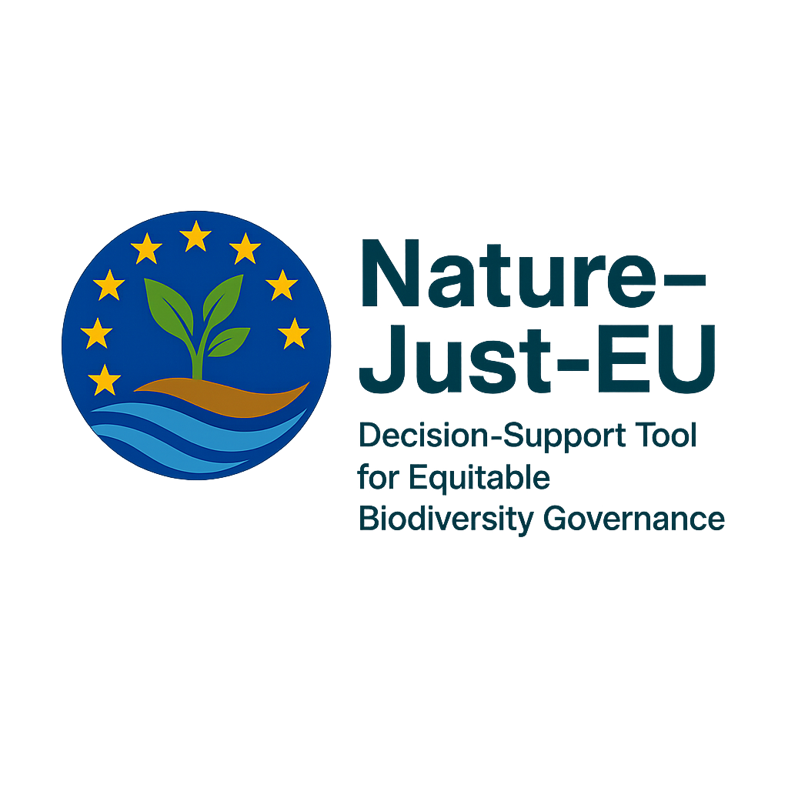

<p align="center">
  
</p>

# NatureJust-EU

**A Decision-Support Tool for Equitable Biodiversity Governance**

NatureJust-EU is an R Shiny application that integrates the Nature Futures Framework (NFF), Global Biodiversity Framework (GBF), and environmental justice principles for marine spatial planning across European seas.

## Features

- **Spatial Equity** -- Interactive Leaflet map of 249 NUTS2 regions with Eurostat-derived vulnerability indicators
- **Scenario Explorer** -- NFF-weighted projections anchored to real MSFD/HELCOM/OSPAR baselines
- **Justice Assessment** -- Four-dimension scorecard with literature-sourced scores and gap analysis
- **Governance & Funding** -- EU regulation-sourced eligibility matrix (EMFAF, LIFE, Cohesion Fund, EAFRD, JTF)
- **Indicator Dashboard** -- Time series (2010--2025) with GBF target compliance tracking

## Getting Started

### Prerequisites

- R >= 4.4.0
- RStudio (recommended)

### Installation

```r
# Install dependencies
install.packages(c(
  "shiny", "bslib", "bsicons", "leaflet", "sf", "plotly", "ggplot2",
  "dplyr", "tidyr", "purrr", "DT", "shinyWidgets", "rnaturalearth",
  "rnaturalearthdata", "htmltools", "config", "eurostat", "giscoR"
))

# Download and cache real EU datasets
source("data-raw/prepare_data.R")

# Launch the app
source("dev/launch.R")
```

## Data Sources

| Dataset | Source | Usage |
|---------|--------|-------|
| NUTS2 geometries | [giscoR / Eurostat](https://ec.europa.eu/eurostat/web/gisco) | Spatial equity map |
| GDP per capita | [Eurostat nama_10r_2gdp](https://ec.europa.eu/eurostat) | Vulnerability index |
| Population | [Eurostat demo_r_d2jan](https://ec.europa.eu/eurostat) | Conservation pressure |
| Justice scores | Academic literature (see `inst/extdata/justice_scores.csv`) | Justice scorecard |
| Funding eligibility | EU regulations (EMFAF 2021/1139, LIFE 2021/783, etc.) | Governance matrix |
| GBF targets | Kunming-Montreal Global Biodiversity Framework | Compliance tracking |

## Author

**Arturas Razinkovas-Baziukas**
[arturas.razinkovas-baziukas@ku.lt](mailto:arturas.razinkovas-baziukas@ku.lt)

## License

MIT
